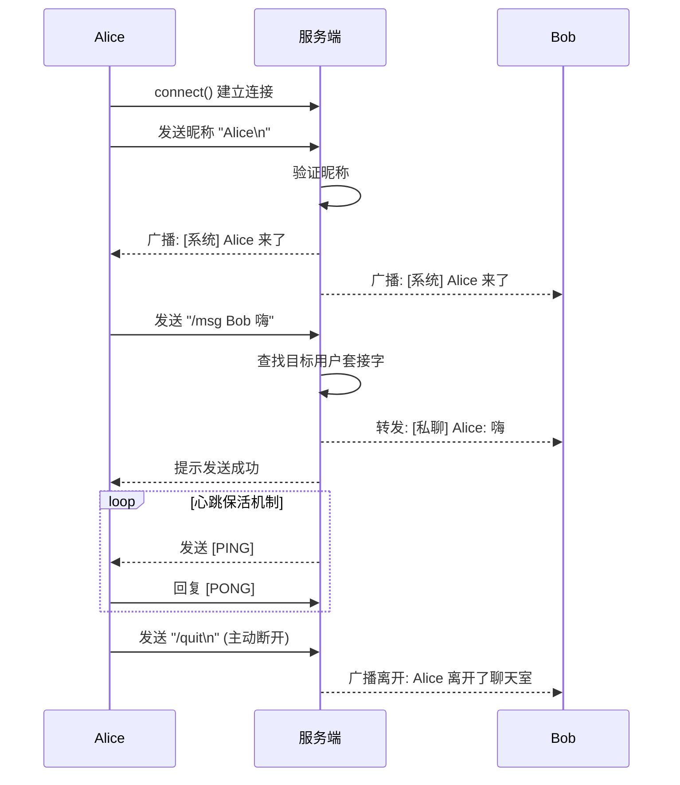

# 局域网多线程群聊软件设计文档

学号：202413020060  
姓名：刘约翰  
学院：计算机学院，软件学院  

## 1. 项目结构
- `server.c`：服务端程序代码。
- `client.c`：客户端程序代码。
- `Makefile`：工程编译脚本。

## 2. 编译与运行
本项目支持跨平台编译。在 macOS/Linux 环境下：
```bash
make
./server
./client 127.0.0.1 8888
```

在 Windows 环境下（使用 MinGW 编译）：
```bat
gcc -std=c11 -Wall server.c -o server.exe -lws2_32
gcc -std=c11 -Wall client.c -o client.exe -lws2_32
```

## 3. 跨平台实现
利用 `#ifdef _WIN32` 宏定义区分不同系统的网络 API，例如：
- Windows 环境下使用 `<winsock2.h>` 并调用 `WSAStartup` 初始化，通过 `closesocket()` 关闭连接。
- UNIX-like 系统下使用 `<sys/socket.h>`，使用 `close()` 关闭连接。

## 4. 并发与多路复用模型
服务端采用 **单线程 `select()` I/O 多路复用** 处理并发连接。
- 相比于每个连接分配一个独立线程，单线程 `select` 极大地降低了内存开销，避免了线程间对全局资源操作时的频繁加锁问题，有效提升了局域网群聊等中等规模并发场景下的系统性能。
- 在主循环中监听所有的套接字，当出现可读事件时分别处理新连接和新消息。

## 5. 应用层协议设计
系统采用明文协议，以换行符 (`\n`) 作为一条命令或消息的结束标志：
- 连接后直接发送昵称进行登录。
- 用户发送消息前缀有 `/msg 用户名 ` 则为私聊。
- `/quit` 退出聊天室。
- `/who` 查看在线用户。
- `/stats` 查看系统运行状态。
- 未带命令前缀的消息则视为公共广播。
- 系统定时下发 `[PING]` 心跳包，客户端需回复 `[PONG]` 进行保活确认。

## 6. 系统交互流程
以下是典型的新用户登录并进行私聊交互的序列图：



## 7. 细节优化
- **TCP Nagle 算法**: 在服务端通过 `setsockopt` 设置 `TCP_NODELAY` 禁用 Nagle 算法，避免小包堆积，以降低用户的交互延迟。
- **安全退出**: 客户端捕获了 `SIGINT` (Ctrl+C) 信号，主动向服务端发送 `/quit` 命令并安全退出，防止服务端因异常中断抛出错误。
